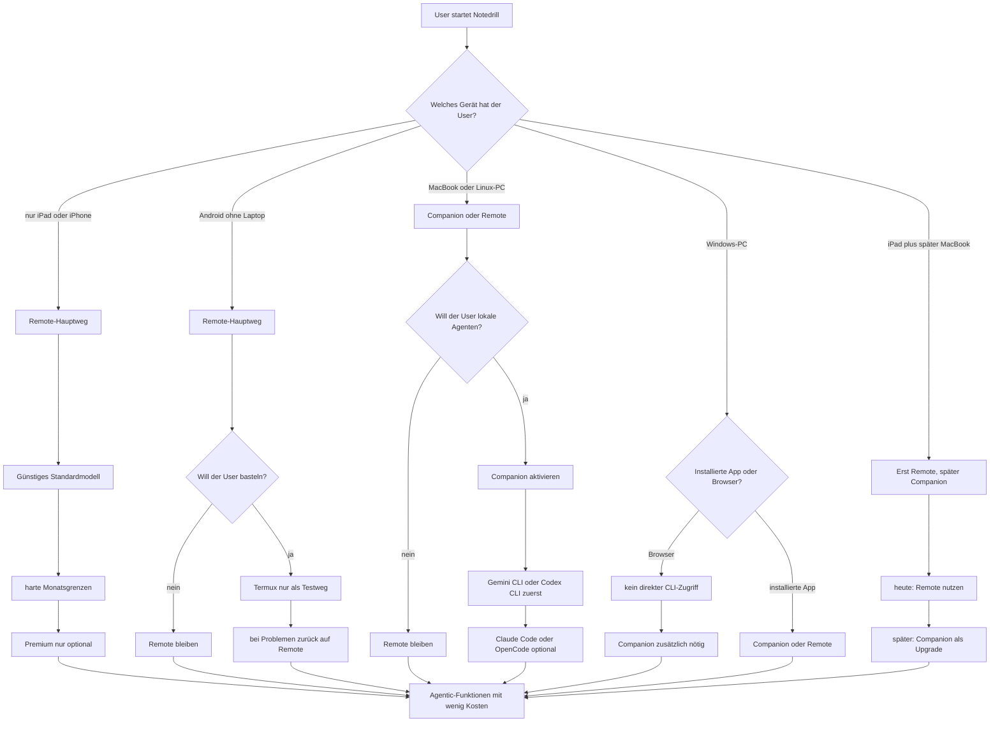
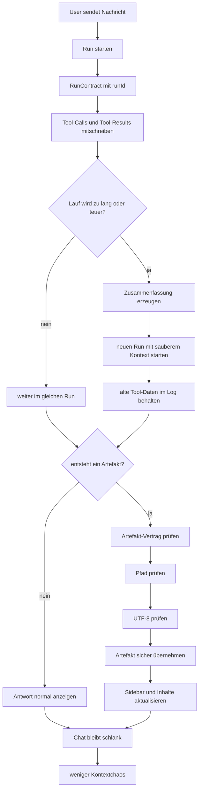
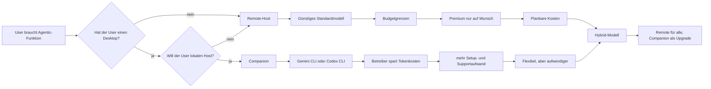

# Notedrill Mobile: Agentic-Userwege, Kosten und Kontext als Mermaid-Diagramme

Stand: 8. März 2026

## Was wurde verstanden?
1. Du willst die Szenarien nicht nur als Text lesen.
2. Du willst Diagramme für Gerätewege, Kosten und Kontext-Stabilität.
3. Die Diagramme sollen zeigen, wie der Nutzer mit möglichst wenig Kosten an Agentic-Funktionen kommt.

## Diagramm 1: Welcher Weg ist für welchen Nutzer sinnvoll?

## Diagramm 2: Wie bleibt der Kontext stabil?

## Diagramm 3: Wie bleiben die Kosten niedrig?

## Diagramm 4: Maßnahmen-Map für die Umsetzung

```mermaid
flowchart TD
    A[Agentic-Feature verbessern] --> B[Verträge]
    A --> C[Host-Wege]
    A --> D[Nutzerführung]
    A --> E[Kontext]
    A --> F[MCP und Skills]
    A --> G[Kosten und Support]

    B --> B1[RunContract]
    B --> B2[Tool-Wörterbuch]
    B --> B3[Artefakt-Vertrag]

    C --> C1[Remote]
    C --> C2[Companion]
    C --> C3[Fallback]
    C --> C4[Termux nur Test]

    D --> D1[Setup-Status]
    D --> D2[Host-Modus sichtbar]
    D --> D3[klare Fehltexte]

    E --> E1[Kontextdateien]
    E --> E2[Zusammenfassung]
    E --> E3[Rollen und Subagents]

    F --> F1[MCP read-only zuerst]
    F --> F2[Skills-Layer]
    F --> F3[MCP-Test und Tool-Liste]

    G --> G1[Budgetlimits]
    G --> G2[Speicherquoten]
    G --> G3[Admin- und Schulmodus]
```

## Welche Diagramme ich am wichtigsten finde
1. Diagramm 1 für Produkt- und Nutzerentscheidung
2. Diagramm 2 für Kontextprobleme
3. Diagramm 3 für Kostenlogik

## Was diese Diagramme für die App bedeuten
1. iPad-only und iPhone-only brauchen fast immer Remote.
2. Companion ist das Upgrade für Desktop-Nutzer.
3. Kosten bleiben nur dann niedrig, wenn der günstige Standardweg klar sichtbar ist.
4. Kontext bleibt nur dann stabil, wenn Runs sauber getrennt und Artefakte sauber übernommen werden.

## Quellen
1. `shared-docs/ai-architecture/03-agentic-umsetzung/notedrill-ki-agentic-massnahmen-und-taskliste.md`
2. `shared-docs/ai-architecture/02-betrieb-und-szenarien/notedrill-ki-szenario-matrix-geraete-und-hosting.md`
3. `shared-docs/ai-architecture/02-betrieb-und-szenarien/notedrill-ki-kosten-speicher-und-abopakete.md`
4. `shared-docs/ai-architecture/toolcall-architecture/08-vergleich-und-was-notedrill-lernen-soll.md`
